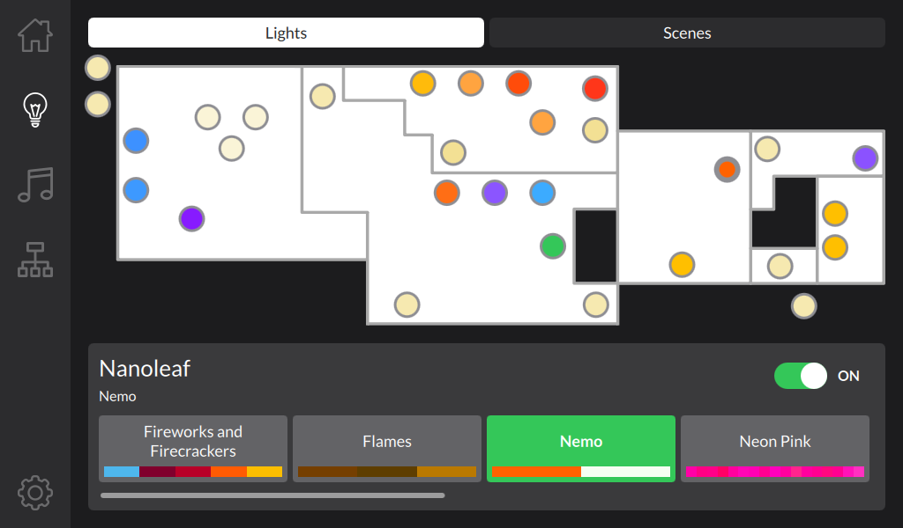
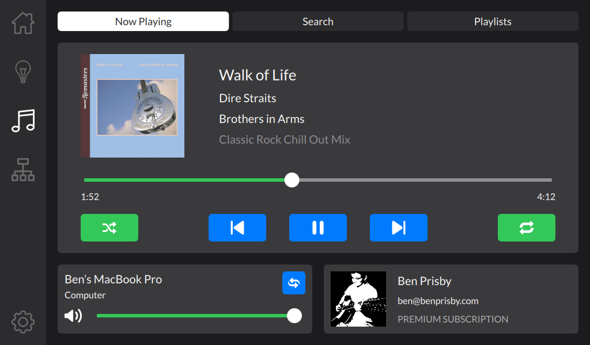

# Vice City Dashboard

Smart home integration dashboard for my apartment, affectionately nicknamed Vice City

## Overview

The motiviation for this project stemmed from a desire to have a centralized physical home hub in the form of a smart dashboard capable of interfacing with many of my smart home products while also providing useful functionality like music control, weather forecasting, and network monitoring all inside a unified, lightweight user experience. The project is built against the [Qt framework](https://www.qt.io), making it easy to build and deploy on a variety of platforms.


## Features

The project offers several plugins that provide functionality within the dashboard.

### Smart Home

#### Philips Hue

The dashboard uses Zeroconf to find the [Philips Hue](https://www.philips-hue.com) Bridge on the local network and then uses its API to continuously query it for the state of all connected lights for live updating. Lights are plotted on a home floor plan map to provide simple a visualization of them. These points can be selected to expose controls for state properties, depending on the type of Hue device (plug, basic light, ambiance light, or color light).


#### Nanoleaf

Similar to the Hue Bridge, the dashboard uses Zeroconf to find the [Nanoleaf](https://nanoleaf.me) on the local network and likewise uses its API to query its state for live updating. It is plotted on a home floor plan map alongside the Hue lights with controls for powering on/off and selecting an installed effect.



#### Scenes

Scenes describe a collective state of many lights across different product types that can be set at the press of a button (e.g. Daytime, Nighttime, Vice City [neon pink everything], Movie, etc.). The scene list is loaded dynamically from the configuration file and displayed in a dedicated tab as well as on the home screen as shortcut buttons to the first 4.


### Spotify

As [Spotify](https://www.spotify.com) is the music subscription of choice within the home, the dashboard offers a subset of Spotify client functionality:

- Real time track playback information and control
- Available output device listing and transferring
- Preferred output device specification to allow music playback to be started any time
- Track searching and queueing
- User playlist listing and launching
- User account overview display




### Pi-hole

A Raspberry Pi running [Pi-hole](https://pi-hole.net) serves as the DNS server for the local network to block ads, malware, and other unwanted requests. Anonymous request and block statistics are tracked as part of this and displayed on the dashboard. The dashboard looks up the hostname of the server on the local network and then queries its API for live information as well as 24-hour historical data that are graphed.


### Weather

To fetch current weather forecast information, the dashboard connects to the [OpenWeather](https://openweathermap.org) API. Current conditions as well as hourly and daily forecasts are displayed on the home screen.

### Fun Facts

While not practical, the [Random Useless Facts](https://uselessfacts.jsph.pl) API drives a small tile on the dashboard home screen to provide the occasional interesting tidbit.

## Architecture

As aforementioned, the dashboard is a Qt application with a QML view and C++ backend. As such, the [Qt Property System](https://doc.qt.io/qt-5/properties.html) is leaned on heavily to encourage an event-driven architecture. While most plugins inherently rely on synchronous fetching of data, connections between resulting data models and the view remain asychronous. The net result is a generally lightweight yet flexible application that still provides a lively, responsive user experience.

While the default (and perhaps preferred) window size of the application is 1024x600 (to suit my personal deployment as mentioned later), it was designed with the mindset of being responsive across different screen resolutions. I do plan on expanding to larger screen sizes in future experiements, though.

A configuration file specifies property values for the various classes. It is structured as a JSON file with keys that denote paths within the Qt object heirarchy (based on object and property names), providing a generic way of representing application configuration data in a persistent fashion. The file is live, with save operations being driven by property change events. JSON value types correlate to property data types specified in the respective header files. A template header file `vcconfig.json` is included in the root of the project as a starting point while also enumerating all intended configurable properties, where placeholder values can be substituted with real ones.

## Building and Running

```
./ViceCityDashboard -c /path/to/vcconfig.json
```

### Development

The simplest way to build and run is to open the project file `ViceCityDashboard.pro` in the Qt Creator IDE. Static building and linking to the required dependency library `QtZeroConf` is handled by this file. The configuration file command line argument above must be specified under Projects > Run.

**NOTE:** At least Qt 5.15 is recommended to build against.

### Deployment

Formal deployment scripts are to come, as they are platform-dependent. I deploy this project on a Raspberry Pi 4 with a connected 1024x600 touchscreen that I compiled Qt 5.15.1 on directly (with EGLFS). As such, I package the source code and build it directly on the target with a systemd service to handle running it to avoid needing to cross-compile.
